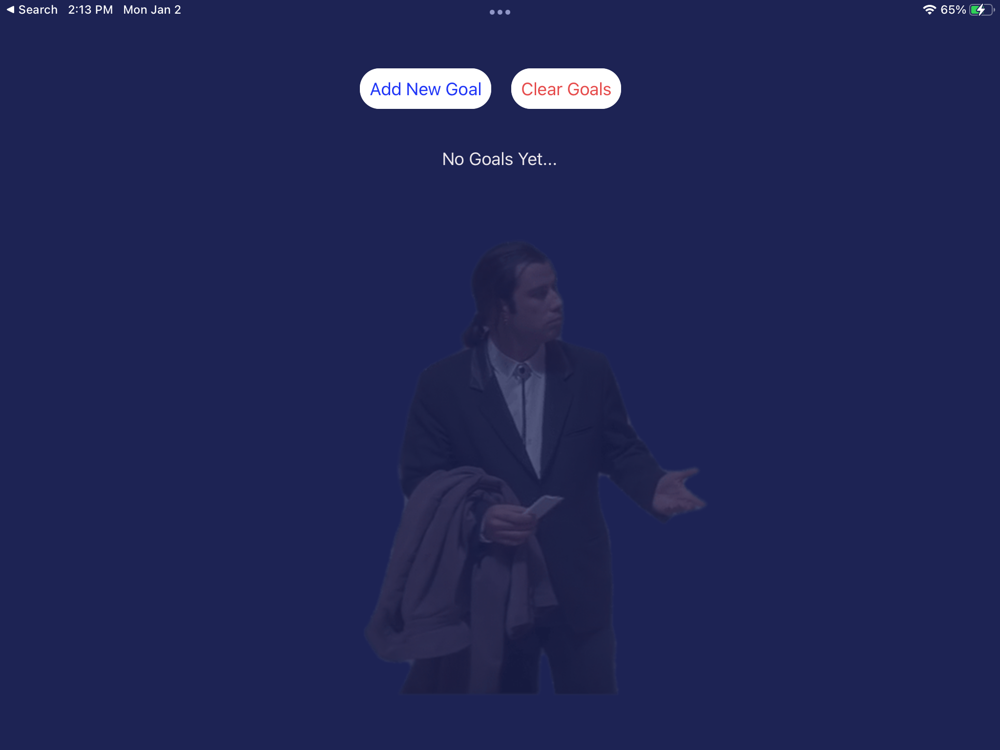
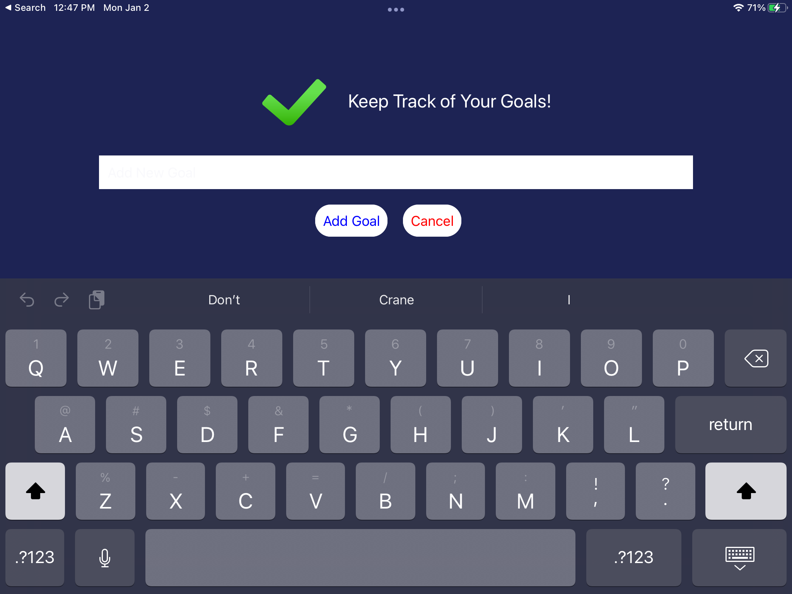
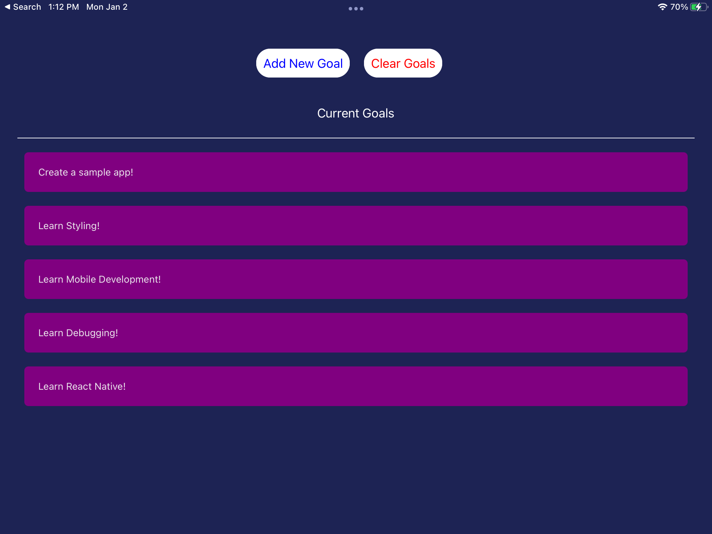

# Sample Goal List React Native Project

This is a sample React Native Project that was created while learning along with [React Native - The Practical Guide](https://www.udemy.com/course/react-native-the-practical-guide/) course on Udemy.

This React Native Project is a simple goal/todo list in order to practice and learn the basics of React Native mobile development.
It has basic screens and logic that will allow for adding items to your goals, removing them, and clearing them. Also adds some basic input validation.

Below are the basic screens:

1. No Items in Goal List:

2. Adding a new Goal:

3. Viewing the Goal List:

